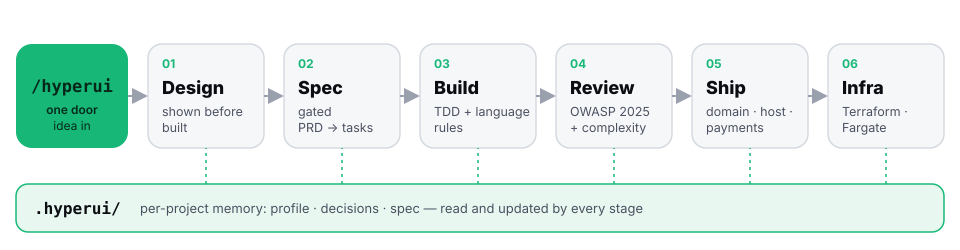
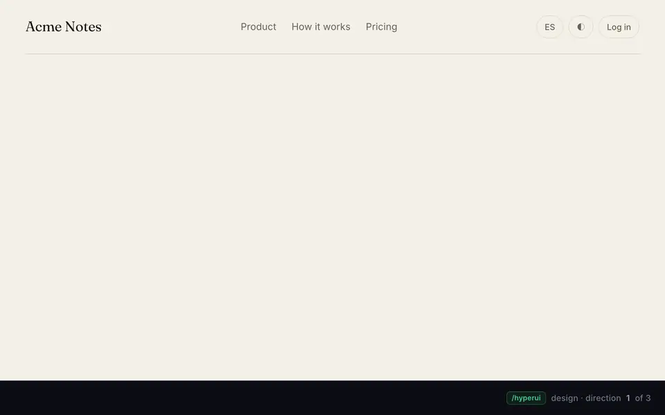
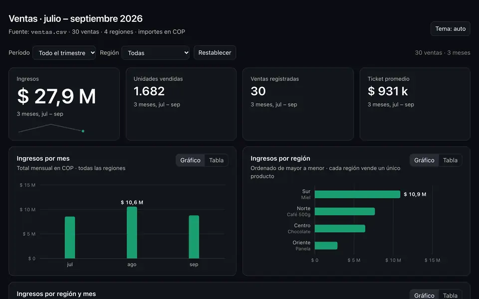

<p align="center"></p>

<p align="center"><b>One door from idea to shipped product. For Claude Code.</b></p>

<p align="center">
  <a href="#quick-start">Quick start</a> · <a href="#how-it-works">How it works</a> · <a href="#examples">Examples</a> · <a href="#specialists">Specialists</a> · <a href="#requirements">Requirements</a> · <a href="#docs">Docs</a>
</p>

<p align="center">
  <a href="https://www.npmjs.com/package/@tizonai/hyperui"></a>
  <a href="https://www.npmjs.com/package/@tizonai/hyperui"></a>
  <a href=".claude-plugin/plugin.json"></a>
  <a href="LICENSE"></a>
  = 2.1.221">
  = 20">
  
</p>

<p align="center"></p>
<p align="center"><i>A landing built with <code>/hyperui:design</code> + <code>/hyperui:motion</code> — recorded from the real page in <a href="docs/assets/demo/">docs/assets/demo/</a> (open it to feel the interactions live).</i></p>

**hyperui** is a [Claude Code](https://code.claude.com) plugin: one visible command, `/hyperui`, takes a product with a UI — web, mobile, macOS, Windows — from idea to shipped. It profiles you in at most three questions, shows design directions before writing any code, plans with gated specs, builds with per-language rules and TDD, reviews security and complexity, and guides shipping (domain, hosting, payments by seller country) and infra.
It remembers everything per project in a `.hyperui/` folder, so you never answer twice — and it works from any directory with `--repo`, including several repos at once.

## Quick start

One command (needs Claude Code installed and signed in):

```
npx @tizonai/hyperui install
```

Or the two plugin lines it runs for you:

```
claude plugin marketplace add tizonai/hyperui
claude plugin install hyperui@tizonai
```

Then restart Claude Code, open your project, run `/hyperui:setup` once, and describe what you want:

```
/hyperui:setup                       # install the stack (HyperFrames, Motion, Motion AI Kit, UI UX Pro Max, Impeccable…) into this project
/hyperui quiero una app para mi gimnasio
```

```
> /hyperui quiero una app para mi gimnasio
Listo. Ya anoté lo que sé: una app para tu propio gimnasio, uso de negocio, en español. Solo me faltan dos cosas:
1. ¿Quién la va a usar? Tú y tu equipo (socios, clases, cobros) o tus socios (reservar clases, ver su plan, hacer check-in)… ¿o ambas?
2. ¿Hay algo ya decidido? Web o móvil, tecnología, marca o colores, fecha límite. Si no, yo propongo.
Siguiente paso: en cuanto respondas la 1, te muestro 2–3 propuestas visuales de la pantalla principal como páginas HTML
para que elijas una, y a partir de ahí planificamos y construimos.
```

`/hyperui` greets once, asks at most three things, then designs, plans, builds, reviews and ships with you, in your language. `/hyperui:doctor` reports what is installed and where (read-only). Say `/hyperui --private` if `.hyperui/` must not be committed.

<details>
<summary>Setup options</summary>

```
/hyperui:setup                       # project scope: skills → ./.claude/skills, motion → package.json, motion MCP → local scope
/hyperui:setup --global              # skills → ~/.claude/skills, motion MCP → user scope (once per machine)
/hyperui:setup --21st-key <key>      # also register the 21st.dev MCP (user scope, key never committed)
/hyperui:setup --motion-plus         # also register the motion-plus MCP (Motion+ subscribers; sign in from the MCP settings)
/hyperui:setup --skip-motion-kit     # no Motion AI Kit (/motion skill, motion-reviewer agent, motion MCP)
/hyperui:setup --skip-motion         # any of: --skip-hyperframes --skip-uipro --skip-motion --skip-motion-kit --skip-21st --skip-frontend-design --skip-impeccable
/hyperui:setup --dry-run             # print the commands, install nothing
```

The 21st.dev key is free at https://21st.dev/mcp. You can also `export TWENTY_FIRST_API_KEY=...` before running setup. The `motion` MCP is registered at project (local) scope by setup — stored in your `~/.claude.json` for this project, never committed — and at user scope with `--global`.

| Component | What it is | Source |
|---|---|---|
| **HyperFrames** | Write HTML/CSS, render deterministic MP4s. Promo clips from your real components. | https://github.com/heygen-com/hyperframes |
| **Motion** | Framer Motion's current package (`motion`), animations for React and vanilla JS. | https://motion.dev |
| **Motion AI Kit** | Official `/motion` skill + hosted `motion` MCP (docs & examples; Motion+ unlocks springs/audits/editor) | https://motion.dev/docs/ai-kit |
| **UI UX Pro Max** | Searchable design intelligence: styles, palettes, font pairings, UX rules. | https://github.com/nextlevelbuilder/ui-ux-pro-max-skill |
| **21st.dev MCP** | 10k+ React/Tailwind components, searchable and generated from the editor. | https://21st.dev/mcp |
| **frontend-design** | Anthropic's official design-direction skill. | `frontend-design@claude-plugins-official` |
| **Impeccable** | Design vocabulary for agents: `/impeccable audit`, `polish`, `typeset`, `critique`… anti-pattern detection. | https://impeccable.style · `pbakaus/impeccable` |

After setup the installed third-party skills are available too: `/motion`, `/hyperframes`, `/ui-ux-pro-max`, `/frontend-design`, `/impeccable <command>`.
</details>

## How it works

<p align="center"></p>

- **Profile and tone by archetype.** Non-tech, developer or senior: detected from your words and your repo, confirmed in at most three questions, never asked twice.
- **Show before build.** 2–3 visual directions as HTML artifacts come before any code; UI is never called done without the Impeccable `audit` → `polish` gate (or one line saying Impeccable is not installed).
- **Gated spec, read as artifacts.** PRD → requirements → design → tasks with approval between phases, or a one-file SDD-lite for small changes, in `.hyperui/spec/`. Every spec file is also published as a Claude artifact (a readable page with table of contents and rendered diagrams) the moment it is written, and the full track ends with one consolidated `Spec: <Topic>` artifact; without the Artifact tool the same page is written next to the markdown.
- **Every step ends with a choice** (continue, do all, fix something, stop) — you never have to guess what to say next.
- **Review before done.** Security (OWASP Top 10:2025, ASVS), complexity and safety pass after every build task; blocking findings are fixed first.
- **Ship never buys or deploys for you.** Domain, DNS, hosting, payments by seller country, store/desktop distribution: it prepares configs and the exact command or clicks; you run every purchase and deploy.

Three languages, kept apart: skill content and everything in `.hyperui/` in English; replies in the language you write in; the product's language(s) and i18n asked explicitly at the brief, never inferred from the conversation.

## Examples

The three clips below are recordings of the plugin's own test runs — nothing staged, nothing retouched.

<p align="center"></p>
<p align="center"><b>Three directions, one brief.</b> Generated before any code — real copy, distinct type and palette, light/dark, entrance motion. You pick one, then it builds.</p>

<table>
<tr>
<td width="50%" valign="top">

<p><b>Data: the table first, then the chart.</b> <code>viz</code> writes Munzner's what–why–how table before drawing; bars, not pie; sources cited.</p>
</td>
<td width="50%" valign="top">

<p><b>Ship: payments for a seller in Colombia.</b> Stripe isn't available there; <code>ship</code> recommends Polar with a source and flags Lemon Squeezy — unedited test run.</p>
</td>
</tr>
</table>

<details>
<summary>Stills and sources</summary>

- **Directions** — the pages themselves, interactive (theme and language toggles work): [Ledger](docs/assets/examples/directions/ledger.html) · [Monolith](docs/assets/examples/directions/monolith.html) · [Atelier](docs/assets/examples/directions/atelier.html). Stills: [strip](docs/assets/examples/directions-strip.png); desktop [Ledger](docs/assets/examples/ledger-1280.png) · [Monolith](docs/assets/examples/monolith-1280.png) · [Atelier](docs/assets/examples/atelier-1280.png); mobile [Ledger](docs/assets/examples/ledger-390.png) · [Monolith](docs/assets/examples/monolith-390.png) · [Atelier](docs/assets/examples/atelier-390.png).
- **Dashboard** — [HTML](docs/assets/examples/dashboard-ventas.html) · [data](docs/assets/examples/ventas.csv) · [still](docs/assets/examples/dashboard-ventas.png). The UI is in Spanish because that was the user's language in the run; the what–why–how card in the clip is in English.
- **Ship** — the answer as text (a test run, unedited), and the [terminal page](docs/assets/examples/ship-terminal.html) the clip was rendered from:

```
Respuesta corta: con Polar. Como vendes desde Colombia,
Stripe no está disponible aquí. Polar cobra por ti, se
encarga de los impuestos de cada país y te paga a tu cuenta.

Recomendado: Polar · 5% + 50¢ por venta, sin cuota mensual,
Colombia aceptada para pagos (verificado hoy)
· https://polar.sh/resources/pricing

Alternativa: Mercado Pago · si tus alumnos están casi todos
en Colombia y pagan con PSE o tarjeta local. …

Evita Lemon Squeezy: se está integrando en un producto de
Stripe que excluye Latinoamérica.
```

How the clips were made: [`docs/assets/README.md`](docs/assets/README.md).

</details>

## Specialists

Every specialist is hidden from the slash menu (`user-invocable: false`) and routed to automatically by `/hyperui`; call one by name if you want:

| Skill | Use |
|---|---|
| `/hyperui:design` | Brief → 2–3 visual directions as artifacts → tokens → components → QA. |
| `/hyperui:motion` | Motion language: easing, durations, choreography, `motion` recipes. |
| `/hyperui:video` | Promo/demo clip with HyperFrames from the project's real tokens and assets. |
| `/hyperui:spec` | Gated PRD → requirements → design → tasks, or a one-file SDD-lite; every spec file shown as an artifact, plus a consolidated spec artifact at the end. |
| `/hyperui:build` | One task at a time: test first, per-language rules, official docs over memory. |
| `/hyperui:review` | Security, complexity and safety pass before anything is called done. |
| `/hyperui:patterns` | DDD, CQRS, hexagonal, GoF, resilience — only when the spec needs one. |
| `/hyperui:ship` | Domain, DNS, hosting, payments by country, store/desktop distribution. |
| `/hyperui:infra` | Terraform/Terragrunt, ECS Fargate vs EKS, GitHub Actions OIDC, state and IAM first. |
| `/hyperui:viz` | Munzner what–why–how analysis before any chart. |
| `/hyperui:git` | Conventional Commits, PRs, releases, hotfixes. |

## Working from any directory

```
/hyperui --repo ~/path/to/project …  # work on a repo from any directory: that path becomes the project root
                                     # (.hyperui/, specs, code, ship files); remembered per directory, so say it once
/hyperui --repo .                    # forget it and work on the current directory again
```

- You can also just say it ("el repo está en ~/x") — the path in words works like `--repo`.
- The mapping is remembered per directory, in the per-machine file `~/.claude/plugins/data/hyperui/user.md` (`roots:`).
- Several repos (`--repo ~/web --repo ~/mobile`, or "the web is in ../web and the api in ../api") form one workspace: each repo keeps its own `.hyperui/`, and the first one holds `.hyperui/workspace.md` (the repos, one role each, the cross-repo next step).

hyperui reads that repo and writes its `.hyperui/` without prompts; to let it run shell commands there (tests, builds) start Claude in the repo or run `/add-dir <path>` once (Claude Code's own rule).

### How it remembers

Project memory lives in `<root>/.hyperui/` (profile, brief, design, spec, decisions, state, ship) and is committed by default, so the next session — or a teammate — picks up the thread. `/hyperui --private` adds `.hyperui/` to `.gitignore` instead. The root is the current directory unless you said `--repo <path>` (or named the path in words): that mapping is stored per directory in `~/.claude/plugins/data/hyperui/user.md` (`roots:`), which also keeps a small profile (level, language, country) so you are not profiled again in a new project.

### Grounding

Advice comes from sources opened at the time (each skill lists them; snapshots in [`docs/research/`](docs/research/README.md)). When an official MCP would help, hyperui shows the exact `claude mcp add` line and asks — it never adds one. `scripts/check.sh` keeps the plugin company-agnostic.

## Requirements

### You need before installing

hyperui does not install these. Each line ends with how to check.

| | Why | Check |
|---|---|---|
| **Claude Code CLI**, signed in to a Claude account (hyperui runs on your own Claude; no hyperui account, no telemetry). No documented minimum for the `"skills": ["./"]` manifest form hyperui uses (only the `"."` spelling needs v2.1.221+); **tested on 2.1.288** — stay current. | runs everything | `claude --version` |
| **macOS** (tested: 15+, Apple Silicon and Intel). Linux should work (bash + python3; untested). Windows only via WSL2 — the hooks and scripts are bash (untested). | hooks, scripts | `uname -s` |
| **git** | `git` specialist, plugin updates | `git --version` |
| **Node 24 LTS recommended, ≥ 20 required** (+ npm; `nvm` is the easiest way to manage versions) | `npx @tizonai/hyperui`, `/hyperui:setup` components, `motion` | `node --version` |
| **python3** (macOS ships it) | `scripts/profile.sh` and `scripts/permit.sh`; without it profile.sh falls back to awk but permit.sh stays silent, so permission prompts appear; UI UX Pro Max search needs it too | `python3 --version` |

Node or python3 missing (or Node < 20)? `/hyperui:setup` prints the install line for your OS (Node 24 via `brew install node@24` / `nvm install 24` / NodeSource 24.x) and offers to run it (`--install-prereqs`, Homebrew on macOS; on Linux/WSL2 you run the printed line).

### hyperui installs for you when missing (nothing to do)

- **Via `/hyperui:setup`:** HyperFrames skills, Motion AI Kit (`/motion` skill, `motion-reviewer` agent, `motion` MCP), UI UX Pro Max skill, Anthropic `frontend-design` plugin, Impeccable plugin, the `motion` npm package in the project.
- **Via `infra`, on first use:** Terraform — asks once, then `brew install hashicorp/tap/terraform` on macOS; on Linux it prints the official install line for you to run.
- **Optional, only if you want them:** the 21st.dev components MCP (free key you create at https://21st.dev/mcp; hyperui registers it when you pass `--21st-key`), provider MCPs (Vercel, Supabase, Stripe, Terraform MCP…: hyperui shows the exact `claude mcp add` line and asks before adding).

### Network and permissions

Outbound HTTPS to the official docs and provider pages the skills cite (`WebFetch` prompts for permission in default mode — expected). The plugin pre-approves only its own skills, its reference reads, `scripts/profile.sh` and writes under `<root>/.hyperui/`; everything else follows your normal Claude Code permissions.

## Docs

- [`docs/architecture.md`](docs/architecture.md) — how it fits together: component tree, flow, hooks, memory, the company-agnostic gate, evals, how to add a specialist. The spec lives in the author's workshop; its Addendum of as-built findings is summarized here.
- [`docs/research/`](docs/research/README.md) — the source snapshots the skills are grounded in (providers and MCPs, engineering sources, Munzner).
- [`CHANGELOG.md`](CHANGELOG.md) — Keep a Changelog, SemVer.
- [`docs/assets/README.md`](docs/assets/README.md) — how the logo, diagram, demo and example clips were produced.

## Local development

```
git clone git@github.com:tizonai/hyperui.git
cd hyperui
bash scripts/check.sh           # validate + lint + company-agnostic grep (strict gate)
claude --plugin-dir .           # load this checkout for one session
claude plugin eval . --scaffold --allow-tools Bash Write Edit --no-publish --trust-plugin   # eval cases in evals/
```

`scripts/check.sh` runs `claude plugin validate .` (manifests + skills), `bash -n` on every script, the frontmatter and preamble lints, and the grep that fails on company-specific strings.

## Updating

Bump `version` in `.claude-plugin/plugin.json`, `.claude-plugin/marketplace.json` **and** `package.json` (`npm run version-check` compares the first and the last), push to `main`, then on each machine:

```
npx @tizonai/hyperui install              # re-running it updates the marketplace and the plugin
claude plugin update hyperui@tizonai
```

## License

Apache License 2.0 — see [`LICENSE`](LICENSE); keep [`NOTICE`](NOTICE) (author attribution) in any redistribution. Third-party components keep their own licenses: [HyperFrames](https://github.com/heygen-com/hyperframes) (Apache-2.0), [Impeccable](https://github.com/pbakaus/impeccable), [UI UX Pro Max](https://github.com/nextlevelbuilder/ui-ux-pro-max-skill), [21st.dev](https://21st.dev), [frontend-design](https://github.com/anthropics/claude-plugins-official).
