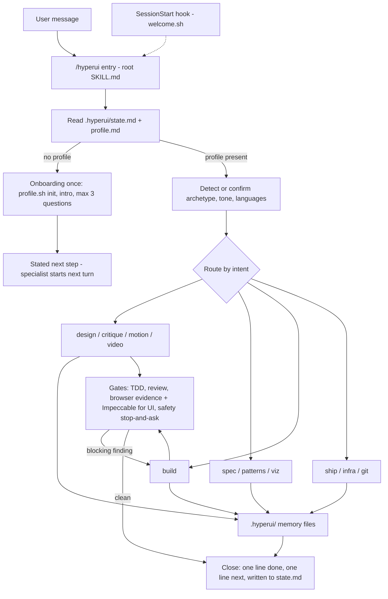

# hyperui architecture

hyperui is a Claude Code plugin that acts as a product copilot: one visible entry (`/hyperui`)
profiles the user, keeps a per-project memory in `.hyperui/`, and routes each request to a
hidden specialist skill. No MCP server of its own, no backend, no telemetry.

## Component tree (as on disk)

```
hyperui/
├── .claude-plugin/
│   ├── plugin.json          # "skills": ["./"] so the root SKILL.md loads next to skills/
│   └── marketplace.json     # tizonai → hyperui
├── SKILL.md                 # /hyperui — the only visible entry (greet · profile · route · dispatch · thread)
├── references/workspace.md  # several repos from one directory: roles, routing, workspace.md
├── references/dispatch.md   # when a job runs inline, in a subagent, in parallel, on which model
├── agents/                  # plugin subagents, namespaced hyperui:<name> (Agent tool subagent_type)
│   ├── builder.md           # one spec task, TDD per skills/build rules · model: inherit
│   ├── reviewer.md          # skills/review checklist on given files · model: sonnet
│   ├── researcher.md        # docs / prices / MCP lookups with URLs · model: haiku
│   └── scout.md             # repo inspection for the profile · model: haiku
├── hooks/hooks.json         # SessionStart(startup) → welcome.sh · PreToolUse → permit.sh
├── skills/
│   ├── setup/  doctor/      # manual (disable-model-invocation: true)
│   ├── design/    references/{sources,browser-verify,version-stamp}.md   # browser-verify: seen-in-Chrome evidence rule
│   ├── critique/  references/{checklist,repair-model,conversion-lens,severity-and-report,sources}.md   # heuristic evaluation vs the goal
│   ├── motion/    references/sources.md
│   ├── video/     references/sources.md
│   ├── spec/      references/{prd,requirements,design,tasks,sdd-lite}-template.md
│   ├── build/     references/rules-{go,python,typescript,react-nextjs,angular,swift,flutter-dart,rust,java}.md, docs-mcps.md
│   ├── review/    references/{security-checklist,complexity-checklist,code-review-tone,safety}.md
│   ├── patterns/  references/{ddd,cqrs,hexagonal,gof,resilience}.md
│   ├── ship/      references/{providers,domains-dns,deploy-recipes,payments-by-country,mobile-desktop}.md
│   ├── infra/     references/{terraform,containers,ci}.md
│   ├── viz/       references/{munzner-procedure,question-to-idiom,munzner-references,munzner-pitfalls,channel-effectiveness}.md
│   └── git/       references/{conventional-commits,pr-template,release,hotfix,branching}.md
├── templates/hyperui/       # seeds for .hyperui/: profile brief state decisions design ship (.md)
├── scripts/
│   ├── setup.sh  doctor.sh  # install / report the third-party stack
│   ├── welcome.sh           # SessionStart: intro when <root>/.hyperui/ is missing, one routing line otherwise, + update offer
│   ├── update-check.sh      # daily check of plugin.json on GitHub main (24 h cache, --decline <v>, silent offline)
│   ├── permit.sh            # PreToolUse: allow hyperui:* skills, reference reads, profile.sh, update-check.sh, verify-deploy.sh, <root>/.hyperui/ writes
│   ├── verify-deploy.sh     # after a deploy: /version.json → <meta app-version> → footer text vs the expected version; polls 30 s × 10 min
│   ├── profile.sh           # init | get | set | private | user-get | user-set | path | root | roots | root-set | root-clear
│   └── check.sh             # quality + company-agnostic gate
├── evals/graders/           # claude plugin eval graders (cases land under evals/<case>/case.yaml)
├── docs/                    # architecture.md (this file), research/ (grounding snapshots)
└── README.md  LICENSE  .gitignore
```

Each specialist, one line:

- `design` — brief → 2–3 directions as HTML artifacts (show before build) → tokens → components (test first) → QA in the browser with evidence.
- `critique` — diagnose a UI (live URL, mock, direction) with the 22 merged checks, the repair model and a conversion lens by goal; evidence, severity 0–4, top 3 by impact on the goal, strengths; report + artifact.
- `motion` — animation recipes on the chosen tokens; reduced motion always honored.
- `video` — promo/demo clip with HyperFrames from the project's real tokens; only when asked.
- `spec` — gated PRD → requirements → design → tasks, or a one-file SDD-lite, in `.hyperui/spec/`.
- `build` — one task at a time, test first, language rules, official docs MCPs over memory.
- `review` — security + complexity + safety on hyperui's own output before "done".
- `patterns` — DDD/CQRS/hexagonal/GoF/resilience only when the spec has the force; else "none".
- `ship` — domain, DNS, host, payments by seller country, store/desktop; the user buys and deploys.
- `infra` — Terraform (Terragrunt for ≥ 2 envs), ECS Fargate by default vs EKS, GitHub Actions OIDC, state + IAM first.
- `viz` — Munzner what–why–how table before any chart; rendering left to the `dataviz` rules.
- `git` — Conventional Commits, SemVer, PRs, releases, hotfixes; GitHub Flow by default; no amend, no force-push.

## Flow



## Dispatch

The entry skill decides, without asking, whether a job runs inline or in a subagent, in parallel, and
on which model (root `SKILL.md` §10, rules in `references/dispatch.md`). A small edit, one task, one
answer, and anything needing taste (architecture, spec, design direction) stay inline on the session
model. "Do all remaining tasks" or three or more independent tasks launch one `hyperui:builder` per
task in a single message (`isolation: worktree` when their files overlap), then a `hyperui:reviewer`
per task; dependent tasks run in sequence. Lookups go to `hyperui:researcher` (`haiku`, returns facts
with URLs), first contact with a repo to `hyperui:scout` (`haiku`, read-only). The agents live in
`agents/*.md` (frontmatter `name`, `description`, `model`, `tools`, `maxTurns`) and are called with the
Agent tool as `subagent_type: "hyperui:<name>"`; a named model that is unavailable falls back to
`inherit`, and agents not listed by the Agent tool fall back to the inline loop. Visibility follows
the archetype — one discreet line for experts, only the result for non-tech — and the user can
override in words ("hazlo con sonnet", "no uses subagentes"), stored as `dispatch:` in `profile.md`.
Every delivered unit of work also ends with the §9 care line (what was handled unasked) before the choice.

## Gates

Four gates stand between "built" and "done", and none accepts a claim in place of evidence. **TDD** is the
default for every code change, UI included: a failing test first (unit for logic, a component/render test
with Testing Library — `getByRole`, accessible name, an `axe` assertion when the project has it — for UI,
e2e for flows), the minimal implementation, refactor; the care line says `tests` only when tests ran green
that turn. **Review** (`skills/review`) runs after each build task; blocking findings are fixed first.
**Browser evidence** (`skills/design/references/browser-verify.md`): UI is never reported done without
captures at 360/768/1280 (1920 for marketing pages), light and dark, one interaction, checked for
horizontal scroll, clipped text, contrast, focus, fold, fonts and image sizing, recorded under
`## Browser evidence` in `.hyperui/design.md`; the tool is detected in order — Claude in Chrome (the
`claude-in-chrome` MCP of an interactive `claude --chrome` session; never in `-p` or in subagents),
Playwright MCP (`/hyperui:setup --playwright-mcp`), a headless Chrome binary — and when none exists the
reply says so and claims only what tests, build and lint prove. Subagents (`hyperui:builder`,
`hyperui:reviewer`) report `needs main-session browser check` instead of claiming. **Impeccable**
`audit` → `polish` closes UI work, with the evidence recorded. **Show before you ask**: no approval, pick,
commit, merge or push question on UI work without the local URL (dev server left running, restart command),
the screenshots (artifact or paths) and one line "what to look at" in the same reply; `git` checks the
evidence exists before proposing a commit of UI changes. `/hyperui:doctor` shows the three browser rows
(Claude in Chrome is per-session and reported as `unknown` from the shell, honestly).

A **critique gate** sits in front of the user's eyes (`skills/critique/references/checklist.md`): every design direction before it is
presented and every UI before "done" gets the quick pass (cognitive load, match/consistency, feedback states, recovery paths, platform
conventions) and severities 3–4 are fixed first; the care line says `heuristics checked`. The full `critique` specialist runs on request.

A fifth gate keeps the **version honest** (`skills/git/references/versioning.md`): every code change hyperui
makes bumps SemVer in the project's version file — PATCH by default, MINOR for a user-facing feature, MAJOR
only on the user's word — and adds a Keep a Changelog line, both staged in the same commit as the change
(`Bumps to vX.Y.Z.` in the body; `chore(release): vX.Y.Z` for a pure release commit); `versioning: off` in
`profile.md` opts a project out, `version_file` remembers where the version lives, and parallel builders
leave the single bump to the session. UI projects get a **version stamp** on their first UI change
(`skills/design/references/version-stamp.md`): the version and short commit injected at build, shown as
`v1.4.2 · ab12cd3` in the footer or About, plus `<meta name="app-version">` and `/version.json` so a script
can read it. After the user runs a deploy, `ship` does not take the host's green check as proof:
`scripts/verify-deploy.sh <url> <expected>` reads `/version.json`, then the meta, then the footer text
(HTML comments stripped), polling every 30 s for up to 10 min, and the result (`deployed vX.Y.Z ✓` or
`still vA.B.C → build log`) is written under `## Deploys` in `.hyperui/ship.md`; the care line says
`deploy verified` only after a match.

## Update check

`scripts/update-check.sh` reads the installed version from `.claude-plugin/plugin.json`, compares it
once a day with the manifest on GitHub `main` (`curl`, 3 s, cache in
`~/.claude/plugins/data/hyperui/update-check.json`: `checked_at`, `latest`, `declined`, `whats_new`),
and prints one JSON line; it is silent on any network error and always exits 0. `welcome.sh` calls it
and, when a newer version exists that the user has not declined, appends the offer to the SessionStart
context; the entry skill (§1) offers the update once, in one line with yes/later, and on "later" runs
`update-check.sh --decline <v>`. `HYPERUI_UPDATE_URL`, `HYPERUI_CHANGELOG_URL` and `HYPERUI_UPDATE_TTL`
point the script at local files for tests.

The hook gives model-facing context only (shape `{"hookSpecificOutput":{"hookEventName":
"SessionStart","additionalContext":…}}`): the full intro when `.hyperui/` is missing, and an
always-on routing line when it exists, so a bare "what can you do?" reaches `/hyperui` instead
of generic help. Several intents in one message run in journey order (design → spec → build →
review → ship). Every specialist starts with: resolve the root with `profile.sh root`; if
`<root>/.hyperui/profile.md` is missing, invoke the `hyperui` skill first.

## Memory model

**Project root.** Every `profile.sh` command, the hooks and every skill resolve the root first:
`HYPERUI_ROOT` → `--repo <path>` (repeatable) → the `roots:` map in the per-machine `user.md`
(current directory → repo or list of repos) → the current directory. `/hyperui --repo <path>` (or
the path said in words) runs `profile.sh root-set`, so a user can work on a repo from any
directory and never repeat the path; `--repo .` forgets it. With several roots the first is the
primary, each repo keeps its own `.hyperui/`, and `<primary>/.hyperui/workspace.md` lists the
repos with a role each (rules in `references/workspace.md`). In the Bash tool `CLAUDE_PROJECT_DIR`
is not exported, so the key is `$PWD`: skills call profile.sh by absolute path and never `cd` first.
`permit.sh` pre-approves reads anywhere under a resolved root and Read/Edit/Write under its
`.hyperui/`; shell commands in a root outside the working directory stay blocked by Claude Code until
the user runs `/add-dir <root>` (or starts there), which the entry skill says once when needed.
For the same reason the per-machine file is pinned to `~/.claude/plugins/data/hyperui/user.md`
(`HYPERUI_DATA` overrides) instead of `${CLAUDE_PLUGIN_DATA}`: hooks receive that variable with an
id-dependent value (`data/hyperui-tizonai` for the marketplace install) and Bash-tool commands never
do, so the two contexts would read different files.

Per project, `<root>/.hyperui/` (seeded from `templates/hyperui/` by `profile.sh init`):

- `profile.md` — YAML frontmatter (archetype, languages, purpose, budget, country, platform, stack, providers, design) + dated notes.
- `brief.md` — five lines: product, audience, the one job, tone words, constraints, product language(s).
- `design.md` — the picked direction: tokens, type, palette, artifact URLs, rejected directions, `## Browser evidence` (captures per viewport/theme, tool used).
- `spec/` — SDD output (`00-prd.md … 03-tasks.md` or `sdd-lite.md`).
- `decisions.md` — ADR-lite, one line each: date · decision · why · source URL.
- `state.md` — phase, next, open items; read first and updated at the end of every turn.
- `ship.md` — the go-live checklist (domain, DNS, host, secrets, deploy, payments, email, monitoring).
- `critique/` — one report per critique (`<yyyy-mm-dd>-<target>.md` + the `.html` fallback page): goal, evidence, verdict, top 3, strengths, findings table, to-verify list; artifact urls in `state.md` `artifacts:`.
- `evidence/<yyyy-mm-dd>/` — the browser captures the design, build and critique passes refer to.

Per machine, `~/.claude/plugins/data/hyperui/user.md`: archetype default, conversation language, country,
tone notes, and the `roots:` map (directory → repo(s)); a known user gets a one-line confirmation
instead of the questions. No product data.

`.hyperui/` is **committed by default**. `/hyperui --private` (or saying it must not be pushed)
runs `profile.sh private`: adds `.hyperui/` to `.gitignore` and sets `private: true`. hyperui
never stages or commits on its own; `git` does, on request.

## Three languages

1. Skill content, references and scripts: English (model-facing).
2. Replies: the language the user writes in, switching when they switch. Code, identifiers,
   commits, PR text and repo docs: English unless the profile says otherwise.
3. Product language(s) and i18n: asked explicitly at the brief, never inferred from the chat.

## Grounding and MCP policy

Open the source before stating; otherwise mark "(unverified)" or omit. Every specialist ends
with `## Sources`; prices are re-fetched from the pricing URL before being quoted. When an
official MCP fits a chosen provider, hyperui shows the exact line
(`claude mcp add --transport http <name> <official-url>`) and asks. It never adds an MCP by
itself and never guesses a URL: it comes from the provider's docs or `docs/research/`, or no MCP.

## Company-agnostic gate

`scripts/check.sh` runs `claude plugin validate .`, `bash -n` on every script, a frontmatter
lint (name + description everywhere; `user-invocable: false`, `allowed-tools` with the plugin-root
Read and the profile.sh Bash rule, and the exact root preamble on specialists), a `## Sources`
lint, an agents lint (`name`, `description`, `model` on every `agents/*.md`), and a grep that fails
on employer- or team-specific strings. `.hyperui-gate` sets
`lenient` (warnings) or `strict` (failures) for the specialist lints. Run it before every commit.

## Hidden specialists and root loading

- A specialist carries `user-invocable: false`: out of the slash menu, still routable by the
  model and callable by name (`/hyperui:ship`). `setup` and `doctor` use
  `disable-model-invocation: true` instead (manual only).
- A root `SKILL.md` does not load when `skills/` exists unless `plugin.json` declares
  `"skills": ["./"]`. Without it the entry is skipped and `design` swallows onboarding.
- `name: hyperui` makes the command `/hyperui:hyperui`; bare `/hyperui` works by the bare-name
  fallback. `argument-hint` gives the autocomplete hint; `when_to_use` makes the entry win over
  specialists' triggers; `allowed-tools` pre-approves `scripts/profile.sh` for headless runs.

## Headless runs and evals

```
claude --plugin-dir . -p "quiero una landing para mi panadería" --setting-sources project,local
```

`--plugin-dir .` loads this checkout; `--setting-sources project,local` keeps the user's global
settings and `CLAUDE.md` out of the run, so evals measure the plugin and not the author's
machine. Cases live in `evals/<case>/case.yaml`, graders in `evals/graders/`.

## Adding a specialist

1. Create `skills/<name>/SKILL.md` with `name`, a trigger-style `description`, `user-invocable: false`.
2. Start it with the exact preamble sentence (`PREAMBLE` in `scripts/check.sh`): resolve the root
   with `profile.sh root`; missing `<root>/.hyperui/profile.md` → invoke `hyperui` first; else read
   profile + state. Declare `Bash(${CLAUDE_PLUGIN_ROOT}/scripts/profile.sh *)` in `allowed-tools`.
3. Put long material in `skills/<name>/references/*.md`, in English, company-agnostic.
4. End it with `## Sources` (URLs from `docs/research/`, opened before writing).
5. Add its row to the routing table in the root `SKILL.md` and its line in the README table.
6. Run `bash scripts/check.sh` and add an eval case under `evals/`.

## Research

Grounding snapshots and how to refresh them: [`docs/research/`](research/README.md).
