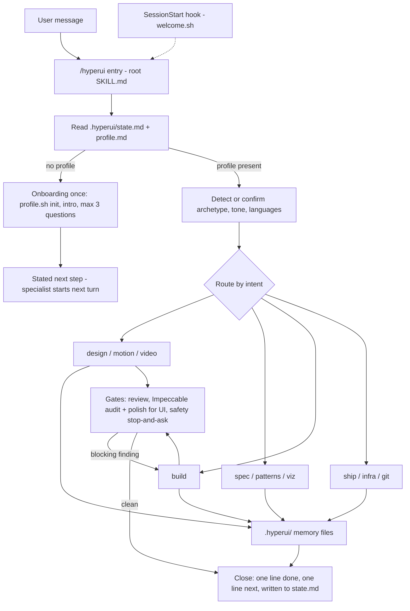

# hyperui architecture

hyperui is a Claude Code plugin that acts as a product copilot: one visible entry (`/hyperui`)
profiles the user, keeps a per-project memory in `.hyperui/`, and routes each request to a
hidden specialist skill. No MCP server of its own, no backend, no telemetry.

## Component tree (as on disk)

```
hyperui/
├── .claude-plugin/
│   ├── plugin.json          # "skills": ["./"] so the root SKILL.md loads next to skills/
│   └── marketplace.json     # tizonai → hyperui
├── SKILL.md                 # /hyperui — the only visible entry (greet · profile · route · thread)
├── hooks/hooks.json         # SessionStart(startup) → scripts/welcome.sh
├── skills/
│   ├── setup/  doctor/      # manual (disable-model-invocation: true)
│   ├── design/    references/sources.md
│   ├── motion/    references/sources.md
│   ├── video/     references/sources.md
│   ├── spec/      references/{prd,requirements,design,tasks,sdd-lite}-template.md
│   ├── build/     references/rules-{go,python,typescript,react-nextjs,angular,swift,flutter-dart,rust,java}.md, docs-mcps.md
│   ├── review/    references/{security-checklist,complexity-checklist,code-review-tone,safety}.md
│   ├── patterns/  references/{ddd,cqrs,hexagonal,gof,resilience}.md
│   ├── ship/      references/{providers,domains-dns,deploy-recipes,payments-by-country,mobile-desktop}.md
│   ├── infra/     references/{terraform,containers,ci}.md
│   ├── viz/       references/{munzner-procedure,question-to-idiom,munzner-references,munzner-pitfalls,channel-effectiveness}.md
│   └── git/       references/{conventional-commits,pr-template,release,hotfix,branching}.md
├── templates/hyperui/       # seeds for .hyperui/: profile brief state decisions design ship (.md)
├── scripts/
│   ├── setup.sh  doctor.sh  # install / report the third-party stack
│   ├── welcome.sh           # SessionStart: intro when .hyperui/ is missing, one routing line otherwise
│   ├── profile.sh           # init [--private] | get | set | private | user-get | user-set | path
│   └── check.sh             # quality + company-agnostic gate
├── evals/graders/           # claude plugin eval graders (cases land under evals/<case>/case.yaml)
├── docs/                    # architecture.md (this file), research/ (grounding snapshots)
└── README.md  LICENSE  .gitignore
```

Each specialist, one line:

- `design` — brief → 2–3 directions as HTML artifacts (show before build) → tokens → components → QA.
- `motion` — animation recipes on the chosen tokens; reduced motion always honored.
- `video` — promo/demo clip with HyperFrames from the project's real tokens; only when asked.
- `spec` — gated PRD → requirements → design → tasks, or a one-file SDD-lite, in `.hyperui/spec/`.
- `build` — one task at a time, test first, language rules, official docs MCPs over memory.
- `review` — security + complexity + safety on hyperui's own output before "done".
- `patterns` — DDD/CQRS/hexagonal/GoF/resilience only when the spec has the force; else "none".
- `ship` — domain, DNS, host, payments by seller country, store/desktop; the user buys and deploys.
- `infra` — Terraform (Terragrunt for ≥ 2 envs), ECS Fargate by default vs EKS, GitHub Actions OIDC, state + IAM first.
- `viz` — Munzner what–why–how table before any chart; rendering left to the `dataviz` rules.
- `git` — Conventional Commits, SemVer, PRs, releases, hotfixes; GitHub Flow by default; no amend, no force-push.

## Flow



The hook gives model-facing context only (shape `{"hookSpecificOutput":{"hookEventName":
"SessionStart","additionalContext":…}}`): the full intro when `.hyperui/` is missing, and an
always-on routing line when it exists, so a bare "what can you do?" reaches `/hyperui` instead
of generic help. Several intents in one message run in journey order (design → spec → build →
review → ship). Every specialist starts with: if `.hyperui/profile.md` is missing, invoke the
`hyperui` skill first.

## Memory model

Per project, `.hyperui/` (seeded from `templates/hyperui/` by `profile.sh init`):

- `profile.md` — YAML frontmatter (archetype, languages, purpose, budget, country, platform, stack, providers, design) + dated notes.
- `brief.md` — five lines: product, audience, the one job, tone words, constraints, product language(s).
- `design.md` — the picked direction: tokens, type, palette, artifact URLs, rejected directions.
- `spec/` — SDD output (`00-prd.md … 03-tasks.md` or `sdd-lite.md`).
- `decisions.md` — ADR-lite, one line each: date · decision · why · source URL.
- `state.md` — phase, next, open items; read first and updated at the end of every turn.
- `ship.md` — the go-live checklist (domain, DNS, host, secrets, deploy, payments, email, monitoring).

Per machine, `${CLAUDE_PLUGIN_DATA}/user.md`: archetype default, conversation language, country,
tone notes; a known user gets a one-line confirmation instead of the questions. No product data.

`.hyperui/` is **committed by default**. `/hyperui --private` (or saying it must not be pushed)
runs `profile.sh private`: adds `.hyperui/` to `.gitignore` and sets `private: true`. hyperui
never stages or commits on its own; `git` does, on request.

## Three languages

1. Skill content, references and scripts: English (model-facing).
2. Replies: the language the user writes in, switching when they switch. Code, identifiers,
   commits, PR text and repo docs: English unless the profile says otherwise.
3. Product language(s) and i18n: asked explicitly at the brief, never inferred from the chat.

## Grounding and MCP policy

Open the source before stating; otherwise mark "(unverified)" or omit. Every specialist ends
with `## Sources`; prices are re-fetched from the pricing URL before being quoted. When an
official MCP fits a chosen provider, hyperui shows the exact line
(`claude mcp add --transport http <name> <official-url>`) and asks. It never adds an MCP by
itself and never guesses a URL: it comes from the provider's docs or `docs/research/`, or no MCP.

## Company-agnostic gate

`scripts/check.sh` runs `claude plugin validate .`, `bash -n` on every script, a frontmatter
lint (name + description everywhere; `user-invocable: false` on specialists), a `## Sources`
lint, and a grep that fails on employer- or team-specific strings. `.hyperui-gate` sets
`lenient` (warnings) or `strict` (failures) for the specialist lints. Run it before every commit.

## Hidden specialists and root loading

- A specialist carries `user-invocable: false`: out of the slash menu, still routable by the
  model and callable by name (`/hyperui:ship`). `setup` and `doctor` use
  `disable-model-invocation: true` instead (manual only).
- A root `SKILL.md` does not load when `skills/` exists unless `plugin.json` declares
  `"skills": ["./"]`. Without it the entry is skipped and `design` swallows onboarding.
- `name: hyperui` makes the command `/hyperui:hyperui`; bare `/hyperui` works by the bare-name
  fallback. `argument-hint` gives the autocomplete hint; `when_to_use` makes the entry win over
  specialists' triggers; `allowed-tools` pre-approves `scripts/profile.sh` for headless runs.

## Headless runs and evals

```
claude --plugin-dir . -p "quiero una landing para mi panadería" --setting-sources project,local
```

`--plugin-dir .` loads this checkout; `--setting-sources project,local` keeps the user's global
settings and `CLAUDE.md` out of the run, so evals measure the plugin and not the author's
machine. Cases live in `evals/<case>/case.yaml`, graders in `evals/graders/`.

## Adding a specialist

1. Create `skills/<name>/SKILL.md` with `name`, a trigger-style `description`, `user-invocable: false`.
2. Start it with the preamble: missing `.hyperui/profile.md` → invoke `hyperui` first; else read profile + state.
3. Put long material in `skills/<name>/references/*.md`, in English, company-agnostic.
4. End it with `## Sources` (URLs from `docs/research/`, opened before writing).
5. Add its row to the routing table in the root `SKILL.md` and its line in the README table.
6. Run `bash scripts/check.sh` and add an eval case under `evals/`.

## Research

Grounding snapshots and how to refresh them: [`docs/research/`](research/README.md).
