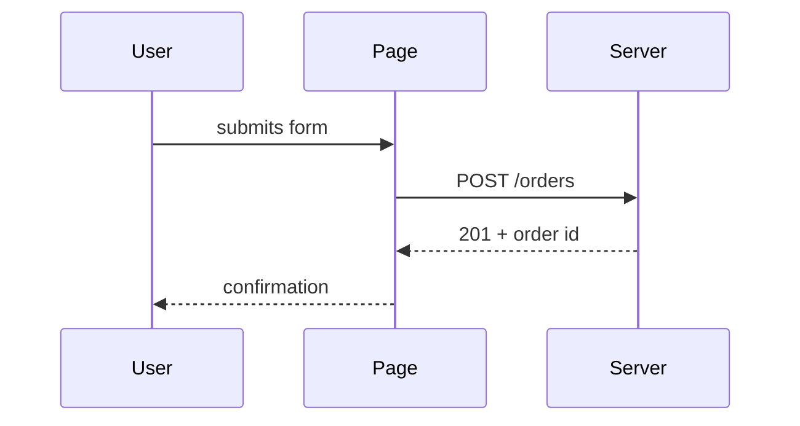

# Design template — `02-design.md`

A blueprint a person or an agent can execute without ambiguity. **Anchor in the code first**:
read the repo's entry points, config, existing components, data layer, migrations folder, docs.
Every path, type, table, route or queue below comes from a file you read, or is marked **new**.
Scale depth to the shape of the change: a single-screen change keeps the summary to 2–3
sentences and one or two diagrams; a multi-service change gets a container diagram and a short
narrative.

## Step 1 — classify, then propose the diagram set (one confirmation)

| Shape | Signals |
|---|---|
| Single screen | one page or component; no data changes |
| Multi-page | several routes/screens, shared layout and tokens, no server state |
| Backend + UI | a database, auth, payments, forms that persist, an API |
| Multi-service | several deployables, queues/topics, webhooks between them |
| New platform | first mobile/desktop target, new repo, new external integration |

Traits that can appear in any shape: **state lifecycle** (an entity moves through states:
`draft → paid → shipped`) and **multi-table** (new relationships, not just columns).

| Diagram (Mermaid) | Include when |
|---|---|
| `sequenceDiagram` | always — happy path **and** the most likely failure |
| `flowchart` | branching logic, retries, decisions a sequence would flatten |
| `stateDiagram-v2` | lifecycle trait — one per entity with states |
| `erDiagram` | multi-table trait — complements the column table, never replaces it |
| `C4Container` / `flowchart` | multi-service or new platform — services, queues, databases |

Propose: "Based on the requirements this is a <shape> change. I'd include <set>. Different?"

## Step 2 — write the file

````markdown
# Design: <Product or change name>

## Glossary                      <!-- non-tech only: ≤ 6 terms used below -->

## Summary
<Which areas are touched and how they interact. The change classification and the confirmed
diagram set.>

## Stack
| Decision | Pick | Why (one line) | Source |
|---|---|---|---|
| Language | <e.g. TypeScript> | <profile: purpose/budget/platform/stack> | <providers.md row, or "profile only"> |
| Framework | <e.g. Astro> | ... | ... |
| Styling | ... | ... | ... |
| Hosting intent | <provider> | <budget × country × purpose> | `skills/ship/references/providers.md` |
<non-tech: chosen for them, never offered as a menu. dev/senior: the repo's existing stack
wins; propose a change only with a reason.>

## Affected components
| Component | Path | Kind | Change |
|---|---|---|---|
| <name> | `<real/path>` | page / component / API / data / config / docs | new / modified |

## Architecture
### Execution mode
<Static site · server-rendered · API + client · background jobs · several — and why.>

### Screens and content
<Per page/screen: purpose, sections, real copy source, product languages / i18n (from the
profile: `product_languages`, `i18n`), tokens taken from `design.md`.>

### API contract                 <!-- N/A — reason, when there is no API -->
<Method + route, input with validations, response shape, status codes per situation.>

### Data model                   <!-- N/A — reason, when nothing is stored -->
<For EVERY table/collection created or changed — no exceptions — a column-level table:>

| Column | Type | Nullable | Notes |
|---|---|---|---|
| `id` | ... | No | primary key |

<Migrations: one logical change per file, named after what it does, never edit an applied
one. Indexes named with the query they serve. Tables only read: "unchanged".>

### Auth and personal data
<Who may do what, per screen/route. Which personal data is stored, where, for how long, and
what is never logged. Resolve explicitly — never by assumption.>

### Errors
<What the user sees per failure; how errors are represented in code and mapped to responses.>

### Configuration and secrets
<Environment variables with defaults; `.env.example` committed, `.env` never. Where secrets live.>

### Async and concurrency        <!-- N/A — reason, when none -->
<Queues, webhooks, retries, idempotency keys, who starts/stops each worker.>

## Diagrams
### Happy path
<caption: 1–2 sentences — what it shows and why it matters>

### Main failure path
<caption>
<diagram>

### <Lifecycle / data / containers — if in the confirmed set>

## Decisions (ADR-lite)
<One block per trade-off, also appended as one line each to `.hyperui/decisions.md`:>
- **<Decision title>** — Context: <forces>. Decision: <we will …>. Consequences: <what gets
  easier, what gets harder>. Status: accepted.

## Implementation considerations
### Security
<Input validation, injection, authorization per route, rate limits, secrets, personal data in
logs and responses.>
### Performance and complexity
<Query cost, N+1 risk, indexes, image/asset budgets, Lighthouse targets for UI.>
### Test strategy
<What is unit-tested, what is integration-tested against real services, what is mocked, test
naming convention. The tests are written first in each task.>
### Observability
<What is logged at which level; no personal data; errors logged once.>

## Documentation to update
<Real files: `README.md`, `docs/…`, the generated API docs. "None" is a valid answer with a why.>

## Dependencies
<New libraries (flagged — installing needs the user's OK), external accounts, other people.>

## Open questions
<Pending technical decisions.>

## Traceability
| Requirement | Design decisions that cover it |
|---|---|
| REQ-001 (<title>) | <section / decision> |

## Revisions
````

## Self-review before presenting
- [ ] Every REQ traces to ≥ 1 design decision
- [ ] Every path was verified in the repo or marked **new** — nothing invented
- [ ] Every table created or changed has a column-level table
- [ ] Stack row has a why and a source; non-tech: chosen for them, one option only
- [ ] Diagram set matches what the user confirmed; every diagram has a caption
- [ ] Auth and personal data resolved explicitly; `.env.example` not `.env`
- [ ] Product languages / i18n from the profile reflected in Screens
- [ ] Docs to update named; sections that do not apply say `N/A — reason`
- [ ] Trade-offs written as ADR-lite and mirrored to `decisions.md`
